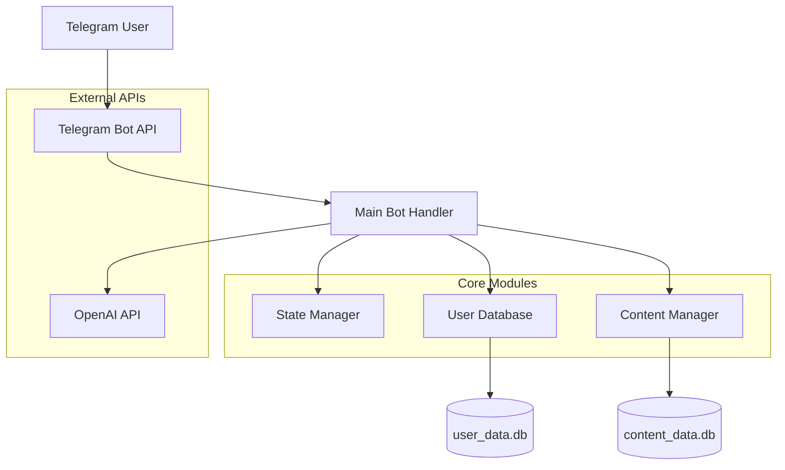
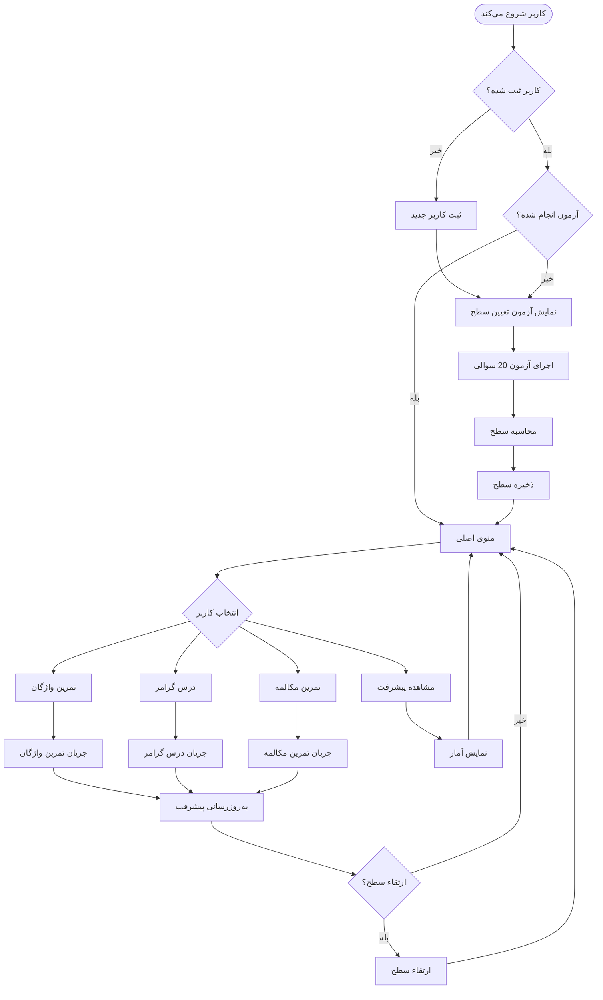
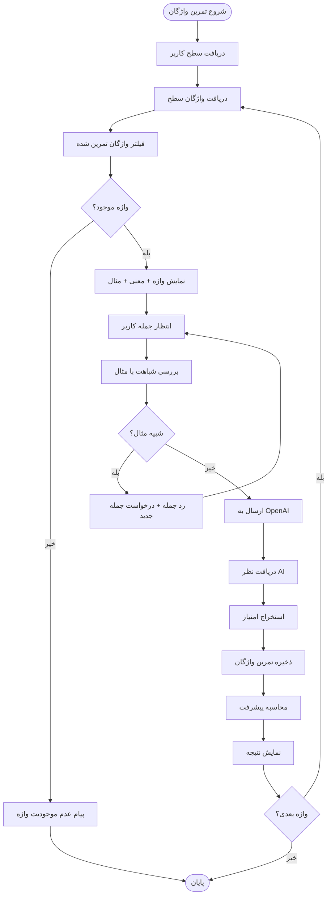
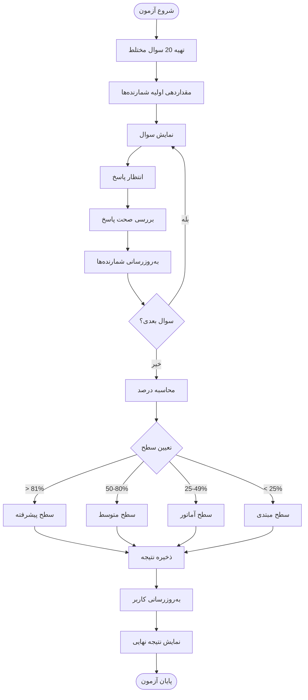

# 🔧 راهنمای فنی سیستم ربات آموزش زبان انگلیسی

## 📋 فهرست مطالب

1. [معماری سیستم](#معماری-سیستم)
2. [Flow Chart عملکرد](#flow-chart-عملکرد)
3. [توضیحات کد](#توضیحات-کد)
4. [الگوریتم‌های کلیدی](#الگوریتمهای-کلیدی)
5. [مدیریت State](#مدیریت-state)
6. [یکپارچه‌سازی AI](#یکپارچهسازی-ai)
7. [بهینه‌سازی عملکرد](#بهینهسازی-عملکرد)
8. [رفع اشکال](#رفع-اشکال)

---

## 🏗️ معماری سیستم

### نمای کلی Components



### طراحی لایه‌ای (Layered Architecture)

```
┌─────────────────────────────────────────┐
│         Presentation Layer              │
│  (Telegram Interface + User Interaction)│
├─────────────────────────────────────────┤
│           Business Logic Layer          │
│    (Bot Logic + Learning Flow)          │
├─────────────────────────────────────────┤
│          Service Layer                  │
│   (AI Integration + Content Management) │
├─────────────────────────────────────────┤
│           Data Access Layer             │
│    (Database Operations + Models)       │
├─────────────────────────────────────────┤
│            Data Layer                   │
│      (SQLite Databases + Files)         │
└─────────────────────────────────────────┘
```

---

## 📊 Flow Chart عملکرد

### 1. جریان اصلی سیستم



### 2. جریان تمرین واژگان



### 3. جریان آزمون تعیین سطح



---

## 💻 توضیحات کد

### 1. ساختار کلی `bot.py`

```python
# Imports و تنظیمات اولیه
import logging
from telegram import Update, ReplyKeyboardMarkup
from telegram.ext import Application, CommandHandler, MessageHandler
from openai import OpenAI
from user_db import UserDatabase
from content_manager import ContentManager

# تعریف States
MAIN_MENU, LEVEL_ASSESSMENT, VOCABULARY_PRACTICE, GRAMMAR_LESSON, CONVERSATION_PRACTICE = range(5)

# متغیرهای Global
user_states = {}  # ذخیره state هر کاربر
db = UserDatabase()  # نمونه پایگاه داده کاربران
content_manager = ContentManager()  # مدیر محتوا
openai_client = OpenAI(api_key=OPENAI_API_KEY)  # کلاینت OpenAI
```

#### توابع کلیدی:

**تابع `start()`:**
```python
async def start(update: Update, context: ContextTypes.DEFAULT_TYPE):
    """تابع شروع ربات - ثبت کاربر و نمایش منو"""
    user_id = update.effective_chat.id
    username = update.effective_user.username or str(user_id)
    
    # ثبت کاربر در پایگاه داده
    is_new = db.register_user(user_id, username)
    db.update_last_active(user_id)
    
    # تنظیم state اولیه
    user_states[user_id] = MAIN_MENU
    
    # بررسی انجام آزمون
    assessment_done = db.is_assessment_done(user_id)
    if not assessment_done:
        # نمایش دکمه آزمون
        keyboard = [[KeyboardButton("🧪 شروع سنجش سطح")]]
        reply_markup = ReplyKeyboardMarkup(keyboard, resize_keyboard=True)
        await update.message.reply_text(welcome_message, reply_markup=reply_markup)
    else:
        # نمایش منوی اصلی
        show_main_menu(update)
```

**تابع `handle_message()`:**
```python
async def handle_message(update: Update, context: ContextTypes.DEFAULT_TYPE):
    """مدیریت پیام‌های کاربر بر اساس state فعلی"""
    user_id = update.effective_chat.id
    message = update.message.text
    state = user_states.get(user_id, MAIN_MENU)
    
    # بررسی دکمه‌های اصلی
    if message == "📚 تمرین لغات":
        await vocabulary_practice(update, context)
    elif message == "📝 درس گرامر":
        await grammar_lesson(update, context)
    elif message == "🗣️ تمرین مکالمه":
        await conversation_practice(update, context)
    # ... سایر دکمه‌ها
    
    # مدیریت state-specific logic
    elif state == VOCABULARY_PRACTICE:
        await handle_vocabulary_practice(update, context, message)
    elif state == GRAMMAR_LESSON:
        await handle_grammar_exercise(update, context, message)
    elif state == CONVERSATION_PRACTICE:
        await handle_conversation_message(update, context, message)
```

### 2. کلاس `UserDatabase`

```python
class UserDatabase:
    def __init__(self, db_path="user_data.db"):
        self.conn = sqlite3.connect(db_path)
        self.cursor = self.conn.cursor()
        self.init_database()
    
    def register_user(self, user_id, username):
        """ثبت کاربر جدید یا به‌روزرسانی username"""
        try:
            # بررسی وجود کاربر
            self.cursor.execute("SELECT username FROM users WHERE user_id = ?", (user_id,))
            existing_user = self.cursor.fetchone()
            
            if existing_user:
                # به‌روزرسانی username در صورت تغییر
                if existing_user[0] != username:
                    self.cursor.execute("UPDATE users SET username = ? WHERE user_id = ?", 
                                      (username, user_id))
                    self.conn.commit()
                return False  # کاربر قبلاً وجود داشته
            else:
                # ثبت کاربر جدید
                now = datetime.now().strftime("%Y-%m-%d %H:%M:%S")
                self.cursor.execute(
                    "INSERT INTO users (user_id, username, join_date, last_active, assessment_done) VALUES (?, ?, ?, ?, ?)",
                    (user_id, username, now, now, 0)
                )
                self.conn.commit()
                return True  # کاربر جدید ثبت شد
        except Exception as e:
            print(f"Error registering user: {e}")
            return False
```

**محاسبه پیشرفت تدریجی:**
```python
def add_section_progress(self, user_id, section, level, increment):
    """افزایش تدریجی پیشرفت بخش (با حد بالا 100%)"""
    # دریافت پیشرفت فعلی
    current = self.get_section_progress(user_id, section, level)
    new_score = min(100, current + increment)  # محدود به 100%
    
    # ذخیره رکورد جدید
    now = datetime.now().strftime("%Y-%m-%d %H:%M:%S")
    self.cursor.execute(
        "INSERT INTO progress (user_id, section, level, score, date) VALUES (?, ?, ?, ?, ?)",
        (user_id, section, level, new_score, now)
    )
    self.conn.commit()
    return new_score
```

### 3. کلاس `ContentManager`

```python
class ContentManager:
    def get_vocabulary_for_level(self, level, count=5, user_id=None):
        """دریافت واژگان بر اساس سطح (فیلتر واژگان تمرین شده)"""
        try:
            # دریافت واژگان تمرین شده کاربر
            studied_words = set()
            if user_id:
                studied_words = self.get_studied_words(user_id)
            
            # Query با فیلتر واژگان تمرین شده
            if studied_words:
                placeholders = ','.join('?' * len(studied_words))
                query = f"""
                    SELECT word, definition, example 
                    FROM vocabulary_words 
                    WHERE level = ? AND word NOT IN ({placeholders})
                    ORDER BY RANDOM() LIMIT ?
                """
                params = [level] + list(studied_words) + [count]
            else:
                query = "SELECT word, definition, example FROM vocabulary_words WHERE level = ? ORDER BY RANDOM() LIMIT ?"
                params = [level, count]
                
            self.cursor.execute(query, params)
            words = []
            for row in self.cursor.fetchall():
                words.append({
                    'word': row[0],
                    'definition': row[1],
                    'example': row[2]
                })
            
            return words
        except Exception as e:
            print(f"Error getting vocabulary: {e}")
            return self.get_fallback_vocabulary(level, count)
```

---

## 🧮 الگوریتم‌های کلیدی

### 1. الگوریتم تعیین سطح

```python
def calculate_level_from_score(percentage):
    """تعیین سطح بر اساس درصد آزمون"""
    if percentage > 81:
        return "advanced"
    elif percentage >= 50:
        return "intermediate"  
    elif percentage >= 25:
        return "amateur"
    else:
        return "beginner"
```

### 2. الگوریتم محاسبه پیشرفت

```python
def calculate_vocabulary_progress(user_id, level, score):
    """محاسبه پیشرفت واژگان"""
    # دریافت تعداد کل واژگان سطح
    total_vocab = content_manager.get_total_vocabulary_count(level)
    
    if total_vocab > 0:
        # محاسبه افزایش پیشرفت برای یک واژه
        progress_increment = (1 / total_vocab) * 100
        
        # اعمال ضریب نمره (حداقل 70% برای تکمیل، حداکثر 100% برای نمره کامل)
        score_multiplier = max(0.7, score / 100)
        final_increment = progress_increment * score_multiplier
        
        # اضافه کردن به پیشرفت
        db.add_section_progress(user_id, 'vocabulary', level, final_increment)
```

### 3. الگوریتم تشخیص سطح خودکار

```python
def check_and_upgrade_level(self, user_id):
    """بررسی و ارتقاء خودکار سطح"""
    current_level = self.get_user_level(user_id)
    levels = ['beginner', 'amateur', 'intermediate', 'advanced']
    
    # اگر کاربر در بالاترین سطح است
    if current_level == 'advanced':
        return False
    
    # بررسی آزمون اخیر (اگر در 24 ساعت گذشته آزمون داده، ارتقاء خودکار نداشته باشد)
    recent_assessment = self.has_recent_assessment(user_id, 24)
    if recent_assessment:
        return False
    
    # بررسی پیشرفت در هر 3 بخش
    current_level_progress = []
    for section in ['vocabulary', 'grammar', 'conversation']:
        progress = self.get_section_progress(user_id, section, current_level)
        current_level_progress.append(progress)
    
    # اگر همه بخش‌ها >= 80% باشند
    if all(score >= 80 for score in current_level_progress):
        idx = levels.index(current_level)
        new_level = levels[idx + 1]
        success = self.update_user_level(user_id, new_level)
        return success
    
    return False
```

### 4. الگوریتم پارس کردن نمره از AI

```python
def parse_ai_score(feedback_text):
    """استخراج نمره از متن بازخورد AI"""
    import re
    
    # الگوهای مختلف برای تشخیص نمره
    score_patterns = [
        r"Score:\s*(\d+)/100",
        r"Score:\s*(\d+)",
        r"نمره:\s*(\d+)",
        r"امتیاز:\s*(\d+)",
        r"(\d+)/100",
        r"(\d+)\s*از\s*100"
    ]
    
    for pattern in score_patterns:
        match = re.search(pattern, feedback_text, re.IGNORECASE)
        if match:
            score = int(match.group(1))
            # اطمینان از محدوده 0-100
            return max(0, min(100, score))
    
    # نمره پیش‌فرض در صورت عدم تشخیص
    return 70
```

---

## 🎛️ مدیریت State

### سیستم State Management

```python
# تعریف State های سیستم
MAIN_MENU = 0
LEVEL_ASSESSMENT = 1  
VOCABULARY_PRACTICE = 2
GRAMMAR_LESSON = 3
CONVERSATION_PRACTICE = 4
VOCABULARY_TEST = 5

# ذخیره state هر کاربر
user_states = {}

def set_user_state(user_id, new_state):
    """تنظیم state جدید برای کاربر"""
    user_states[user_id] = new_state
    logger.info(f"User {user_id} state changed to {new_state}")

def get_user_state(user_id):
    """دریافت state فعلی کاربر"""
    return user_states.get(user_id, MAIN_MENU)

def reset_user_state(user_id):
    """بازنشانی state به منوی اصلی"""
    user_states[user_id] = MAIN_MENU
```

### Context Data Management

```python
# مدیریت داده‌های موقت در context
def store_context_data(context, key, value):
    """ذخیره داده موقت"""
    if 'user_data' not in context.user_data:
        context.user_data['user_data'] = {}
    context.user_data['user_data'][key] = value

def get_context_data(context, key, default=None):
    """دریافت داده موقت"""
    return context.user_data.get('user_data', {}).get(key, default)

def clear_context_data(context):
    """پاک کردن داده‌های موقت"""
    if 'user_data' in context.user_data:
        context.user_data['user_data'].clear()
```

---

## 🤖 یکپارچه‌سازی AI

### تنظیمات OpenAI

```python
from openai import OpenAI

# تنظیم کلاینت
openai_client = OpenAI(api_key=OPENAI_API_KEY)

# تابع کلی برای فراخوانی AI
async def call_openai_api(prompt, max_tokens=150, temperature=0.7):
    """فراخوانی API OpenAI با مدیریت خطا"""
    try:
        response = openai_client.chat.completions.create(
            model="gpt-3.5-turbo",
            messages=[{"role": "user", "content": prompt}],
            max_tokens=max_tokens,
            temperature=temperature
        )
        return response.choices[0].message.content
    except Exception as e:
        logger.error(f"OpenAI API error: {e}")
        return None
```

### Prompt Engineering برای بخش‌های مختلف

**واژگان:**
```python
def create_vocabulary_prompt(word, user_sentence):
    """ایجاد prompt برای ارزیابی واژگان"""
    return f"""You are an English teacher. A student has been given a vocabulary word and asked to use it in a sentence.

Vocabulary word: "{word}"
Student's sentence: "{user_sentence}"

Evaluate the student's sentence based on these criteria:
1. Did they use the vocabulary word correctly? (50 points)
2. Is the sentence grammatically correct? (30 points)  
3. Is the sentence original and creative? (20 points)

Be generous with scoring - if the student made a good attempt, they can get full points in that category.
Provide feedback in Persian, being encouraging and constructive.
Format the score clearly at the end, e.g., Score: 85/100."""
```

**گرامر:**
```python
def create_grammar_prompt(lesson_title, lesson_content, user_sentence):
    """ایجاد prompt برای ارزیابی گرامر"""
    return f"""You are an English grammar teacher. A student is practicing the grammar lesson: "{lesson_title}"

Grammar rule being practiced:
{lesson_content}

The student wrote this sentence: "{user_sentence}"

Evaluate the student's sentence specifically based on:
1. Correct application of "{lesson_title}" grammar rule (60 points)
2. Grammatical accuracy (30 points)
3. Natural English expression (10 points)

IMPORTANT: Your evaluation must focus on how well the student applied the specific grammar topic "{lesson_title}" that they are currently learning.

Provide feedback in Persian, being encouraging and constructive.
Format the score clearly at the end, e.g., Score: 85/100."""
```

**مکالمه:**
```python
def create_conversation_prompt(topic, user_message, message_number):
    """ایجاد prompt برای ارزیابی مکالمه"""
    return f"""You are an English teacher helping a student practice conversation.

Topic: "{topic['title']}"
Topic Description: "{topic['description']}"
Student's message #{message_number}: "{user_message}"

Please evaluate the student's response based on:
1. Grammar accuracy (40 points)
2. Vocabulary usage and appropriateness (30 points)
3. Relevance to the topic (20 points)  
4. Fluency and natural expression (10 points)

Provide constructive feedback in Persian, being encouraging but also pointing out areas for improvement.
End your response with: Score: XX/100

Keep your feedback concise but helpful."""
```

---

## ⚡ بهینه‌سازی عملکرد

### 1. Database Optimization

```python
# استفاده از Connection Pooling
class DatabaseConnection:
    _instance = None
    _connection = None
    
    def __new__(cls):
        if cls._instance is None:
            cls._instance = super().__new__(cls)
        return cls._instance
    
    def get_connection(self):
        if self._connection is None:
            self._connection = sqlite3.connect('user_data.db', check_same_thread=False)
        return self._connection

# Prepared Statements
def get_user_progress_optimized(user_id):
    """نسخه بهینه‌شده دریافت پیشرفت"""
    conn = DatabaseConnection().get_connection()
    cursor = conn.cursor()
    
    # استفاده از prepared statement
    cursor.execute("""
        SELECT section, level, score 
        FROM progress 
        WHERE user_id = ? 
        ORDER BY date DESC
    """, (user_id,))
    
    return cursor.fetchall()
```

### 2. Caching Strategy

```python
from functools import lru_cache
import time

# Cache برای محتوای ثابت
@lru_cache(maxsize=128)
def get_vocabulary_cached(level, count):
    """واژگان cache شده"""
    return content_manager.get_vocabulary_for_level(level, count)

# Cache با TTL برای داده‌های دینامیک
class TTLCache:
    def __init__(self, ttl=300):  # 5 دقیقه
        self.cache = {}
        self.ttl = ttl
    
    def get(self, key):
        if key in self.cache:
            value, timestamp = self.cache[key]
            if time.time() - timestamp < self.ttl:
                return value
            else:
                del self.cache[key]
        return None
    
    def set(self, key, value):
        self.cache[key] = (value, time.time())

# استفاده
user_progress_cache = TTLCache(ttl=300)
```

### 3. Async Operations

```python
import asyncio
from concurrent.futures import ThreadPoolExecutor

# Thread pool برای عملیات I/O
executor = ThreadPoolExecutor(max_workers=4)

async def async_database_operation(operation, *args):
    """اجرای عملیات پایگاه داده به صورت async"""
    loop = asyncio.get_event_loop()
    return await loop.run_in_executor(executor, operation, *args)

async def async_openai_call(prompt):
    """فراخوانی OpenAI به صورت async"""
    loop = asyncio.get_event_loop()
    return await loop.run_in_executor(executor, call_openai_api, prompt)
```

---

## 🐛 رفع اشکال

### 1. Debug Logging

```python
import logging

# تنظیم logging سطح‌بندی شده
def setup_logging():
    logging.basicConfig(
        level=logging.INFO,
        format='%(asctime)s - %(name)s - %(levelname)s - %(message)s',
        handlers=[
            logging.FileHandler('bot.log'),
            logging.StreamHandler()
        ]
    )

logger = logging.getLogger(__name__)

# استفاده در کد
def vocabulary_practice(update, context):
    user_id = update.effective_chat.id
    logger.info(f"User {user_id} started vocabulary practice")
    
    try:
        # کد اصلی
        pass
    except Exception as e:
        logger.error(f"Error in vocabulary practice for user {user_id}: {e}", exc_info=True)
```

### 2. Error Handling Patterns

```python
# Decorator برای مدیریت خطاهای رایج
def handle_exceptions(func):
    async def wrapper(*args, **kwargs):
        try:
            return await func(*args, **kwargs)
        except Exception as e:
            logger.error(f"Error in {func.__name__}: {e}")
            # اقدام مناسب برای بازیابی
            await send_error_message(args[0])
    return wrapper

@handle_exceptions
async def vocabulary_practice(update, context):
    # کد اصلی
    pass

# مدیریت خطاهای مخصوص
async def safe_openai_call(prompt, retries=3):
    """فراخوانی OpenAI با retry logic"""
    for attempt in range(retries):
        try:
            response = await call_openai_api(prompt)
            return response
        except Exception as e:
            logger.warning(f"OpenAI attempt {attempt + 1} failed: {e}")
            if attempt == retries - 1:
                return "متاسفانه در حال حاضر امکان پردازش وجود ندارد."
            await asyncio.sleep(2 ** attempt)  # Exponential backoff
```

### 3. Health Checks

```python
async def health_check():
    """بررسی سلامت سیستم"""
    status = {
        'database': False,
        'openai': False,
        'telegram': False
    }
    
    # تست پایگاه داده
    try:
        db.cursor.execute("SELECT 1")
        status['database'] = True
    except Exception as e:
        logger.error(f"Database health check failed: {e}")
    
    # تست OpenAI
    try:
        response = await call_openai_api("Test", max_tokens=10)
        status['openai'] = response is not None
    except Exception as e:
        logger.error(f"OpenAI health check failed: {e}")
    
    # تست Telegram
    try:
        # Test bot info
        status['telegram'] = True
    except Exception as e:
        logger.error(f"Telegram health check failed: {e}")
    
    return status
```

### 4. Debug Commands

```python
async def debug_user_command(update, context):
    """دستور debug برای بررسی وضعیت کاربر"""
    user_id = update.effective_chat.id
    
    # جمع‌آوری اطلاعات debug
    debug_info = {
        'user_id': user_id,
        'state': user_states.get(user_id, 'UNKNOWN'),
        'level': db.get_user_level(user_id),
        'assessment_done': db.is_assessment_done(user_id),
        'progress': db.get_user_progress(user_id),
        'last_active': db.get_last_active(user_id)
    }
    
    # ارسال اطلاعات debug
    debug_text = f"""
🔧 Debug Info for User {user_id}:
- State: {debug_info['state']}
- Level: {debug_info['level']}
- Assessment Done: {debug_info['assessment_done']}
- Last Active: {debug_info['last_active']}
    """
    
    await update.message.reply_text(debug_text)
```

---

## 📊 مانیتورینگ و Analytics

### کلیدهای Performance

```python
import time
from functools import wraps

def measure_performance(func):
    """اندازه‌گیری زمان اجرا"""
    @wraps(func)
    async def wrapper(*args, **kwargs):
        start_time = time.time()
        result = await func(*args, **kwargs)
        end_time = time.time()
        
        logger.info(f"{func.__name__} executed in {end_time - start_time:.2f} seconds")
        return result
    return wrapper

@measure_performance
async def vocabulary_practice(update, context):
    # کد اصلی
    pass
```

### آمارگیری استفاده

```python
class UsageStats:
    def __init__(self):
        self.stats = {
            'total_users': 0,
            'active_users_today': set(),
            'commands_used': {},
            'ai_calls': 0,
            'errors': 0
        }
    
    def track_user_activity(self, user_id):
        self.stats['active_users_today'].add(user_id)
    
    def track_command(self, command):
        if command not in self.stats['commands_used']:
            self.stats['commands_used'][command] = 0
        self.stats['commands_used'][command] += 1
    
    def track_ai_call(self):
        self.stats['ai_calls'] += 1
    
    def track_error(self):
        self.stats['errors'] += 1
    
    def get_daily_report(self):
        return {
            'active_users': len(self.stats['active_users_today']),
            'most_used_command': max(self.stats['commands_used'], key=self.stats['commands_used'].get),
            'ai_calls': self.stats['ai_calls'],
            'error_rate': self.stats['errors'] / max(1, self.stats['ai_calls'])
        }

# استفاده Global
usage_stats = UsageStats()
```

---

**📝 نتیجه‌گیری:** این راهنمای فنی جزئیات کامل پیاده‌سازی سیستم را پوشش می‌دهد. برای سؤالات بیشتر یا رفع اشکال، به بخش‌های مختلف این مستند مراجعه کنید.

---
*آخرین به‌روزرسانی: 2024*
